# ocr_sederhana

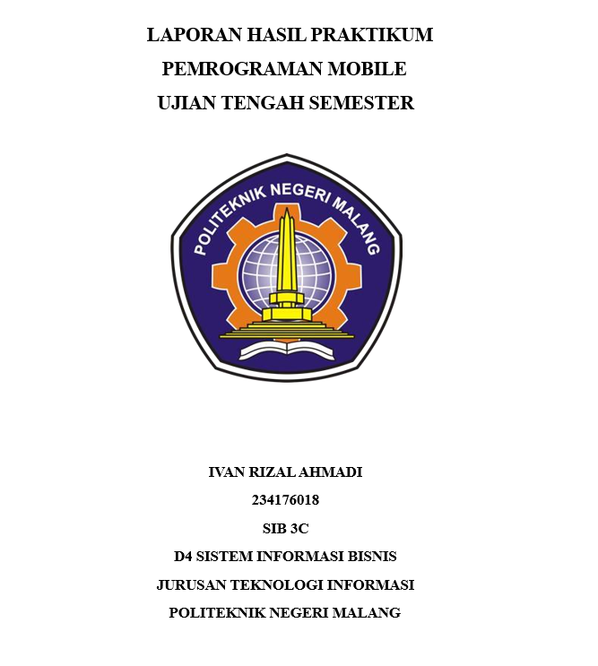

## UJIAN TENGAH SEMESTER (UTS) - PRAKTIKUM
Mata Kuliah: Pemrograman Mobile - Aplikasi OCR

Semester: Ganjil Tahun Akademik: 2025/2026

## Soal 1: Modifikasi Struktur Navigasi dan Aliran
Tujuan: Menyederhanakan alur navigasi dan meningkatkan pengalaman pengguna di
HomeScreen.

# A. Pengubahan navigasi home
- Ubah ElevatedButton di HomeScreen (lib/screens/home_screen.dart) men-
  jadi widget ListTile
- Atur ListTile: leading: Icon(Icons.camera_alt, color: Colors.blue);
  title: Text(’Mulai Pindai Teks Baru’).
- Fungsi onTap harus menggunakan Navigator.push() untuk ke ScanScreen.
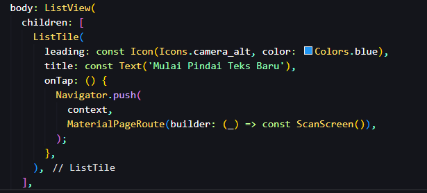

Sebelumnya, tombol di halaman utama (HomeScreen) berbentuk tombol biasa (ElevatedButton).
Sekarang saya ubah menjadi ListTile agar tampilannya sesuai dengan praktikum UTS. Outputnya adalah seperti berikut:
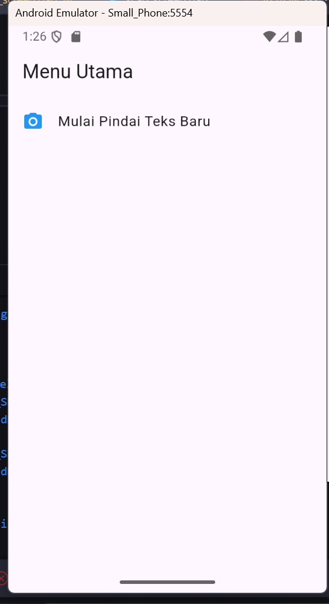

Tombol ElevatedButton pada halaman utama diubah menjadi komponen ListTile dengan ikon kamera dan teks "Mulai Pindai Teks Baru".
Perubahan ini dilakukan untuk memberikan antarmuka yang lebih dinamis dan modern, serta memudahkan pengembangan menu tambahan di masa depan.
Fungsi navigasi menggunakan Navigator.push() tetap dipertahankan untuk berpindah ke halaman ScanScreen ketika akan menekan menu tersebut.

# B. Teks Utuh dan Navigasi Balik
- Di ResultScreen (lib/screens/result_screen.dart), hapus fungsi ocrText.replaceAll
  agar hasil teks ditampilkan dengan baris baru (\n) yang utuh.
- Tambahkan FloatingActionButton dengan ikon Icons.home.
- Ketika tombol ditekan, navigasi harus kembali langsung ke HomeScreen meng-
  gunakan Navigator.pushAndRemoveUntil() (atau metode yang setara)
  untuk menghapus semua halaman di atasnya dari stack navigasi.
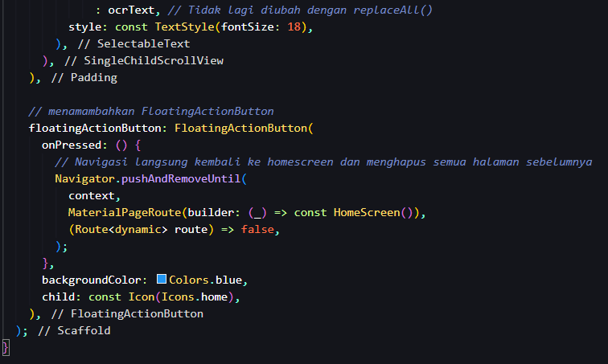
Jangan lupa untuk menambahkan import home_screen
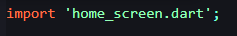
Lalu untuk outputnya adalah sebagai berikut
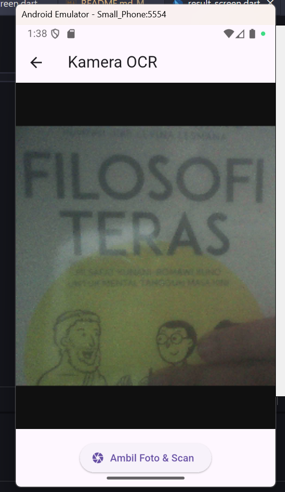
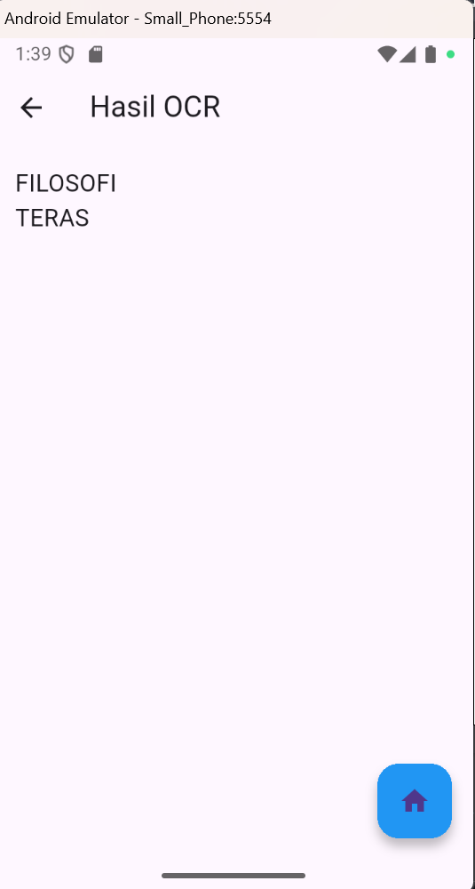
fungsi replaceAll('\n', ' ') dihapus agar teks hasil pemindaian ditampilkan sesuai format aslinya, termasuk jeda baris.
Selain itu, ditambahkan FloatingActionButton dengan ikon home untuk mempermudah pengguna kembali ke halaman utama.
Tombol ini menggunakan metode Navigator.pushAndRemoveUntil() agar seluruh riwayat halaman sebelumnya dihapus dari navigation stack, sehingga aplikasi langsung kembali ke HomeScreen tanpa menekan tombol back berkali-kali.

## Soal 2: Penyesuaian Tampilan dan Penanganan State/Error

# A. Custom Loading Screen di ScanScreen
Di ScanScreen (lib/screens/scan_screen.dart), modifikasi tampilan load-ing yang muncul sebelum kamera siap (if (!controller.value.isInitialized)) :
• Latar Belakang: Scaffold(backgroundColor: Colors.grey900).
• Isi: Di dalam Center, tampilkan Column berisi CircularProgressIndicator(colo
Colors.yellow).
• Di bawah indikator, tambahkan Text(’Memuat Kamera... Harap tunggu.’,
style: TextStyle(color: Colors.white, fontSize: 18)).

Sebelumnya, hanya menampilkan indikator tanpa teks.
Kini, latar belakang diatur menjadi warna abu gelap (Colors.grey900) dengan indikator kuning (Colors.yellow) dan teks "Memuat Kamera... Harap tunggu.".
Perubahan ini membantu pengguna memahami bahwa aplikasi sedang menyiapkan kamera, bukan mengalami gangguan.
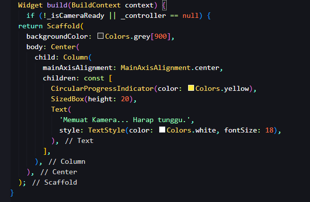

output : 

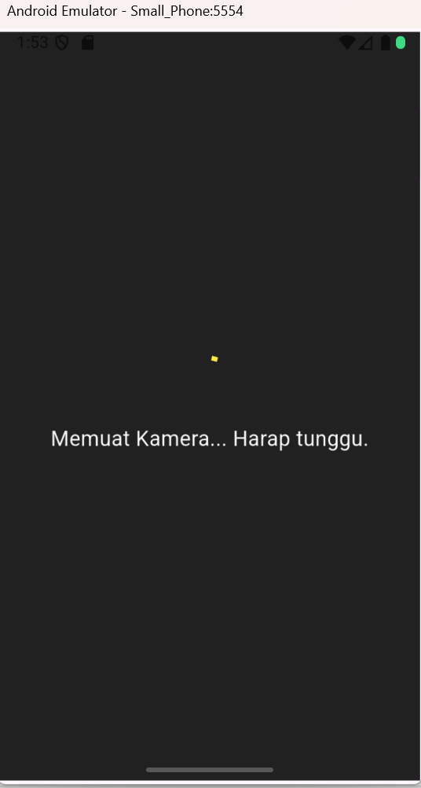

# B. Spesifikasi Pesan Error
• Di fungsi _takePicture() pada ScanScreen, modifikasi blok catch (e) un-
tuk mengubah pesan *error pada SnackBar.
• Pesan SnackBar harus berbunyi: "Pemindaian Gagal! Periksa Izin Kam-
era atau coba lagi." (Hilangkan variabel *error ($e)).
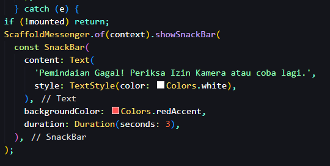

untuk menampilkan output nya saya harus memodifikasi izin kamera terlebih dahulu:
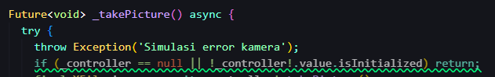

Output:
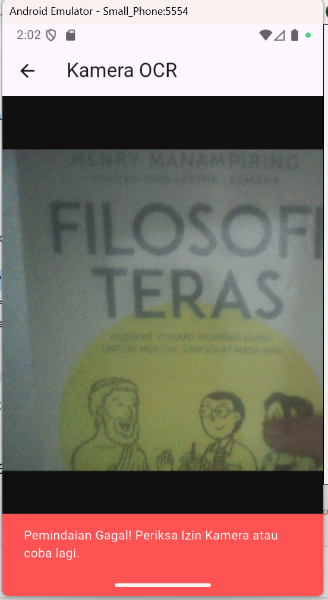

Blok catch (e) di fungsi _takePicture() dimodifikasi agar pesan kesalahan ditampilkan lebih ramah dan tidak menampilkan detail teknis.
Pesan baru pada SnackBar berbunyi:

“Pemindaian Gagal! Periksa Izin Kamera atau coba lagi.”
Langkah ini membuat aplikasi lebih profesional, karena pengguna mendapatkan pesan yang mudah dimengerti tanpa melihat kode error internal.

This project is a starting point for a Flutter application.

A few resources to get you started if this is your first Flutter project:

- [Lab: Write your first Flutter app](https://docs.flutter.dev/get-started/codelab)
- [Cookbook: Useful Flutter samples](https://docs.flutter.dev/cookbook)

For help getting started with Flutter development, view the
[online documentation](https://docs.flutter.dev/), which offers tutorials,
samples, guidance on mobile development, and a full API reference.
